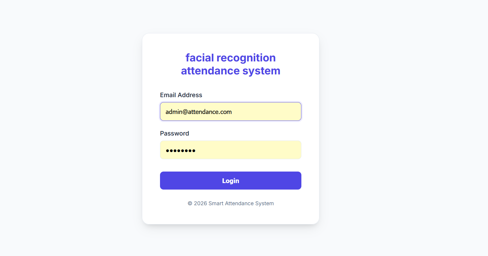
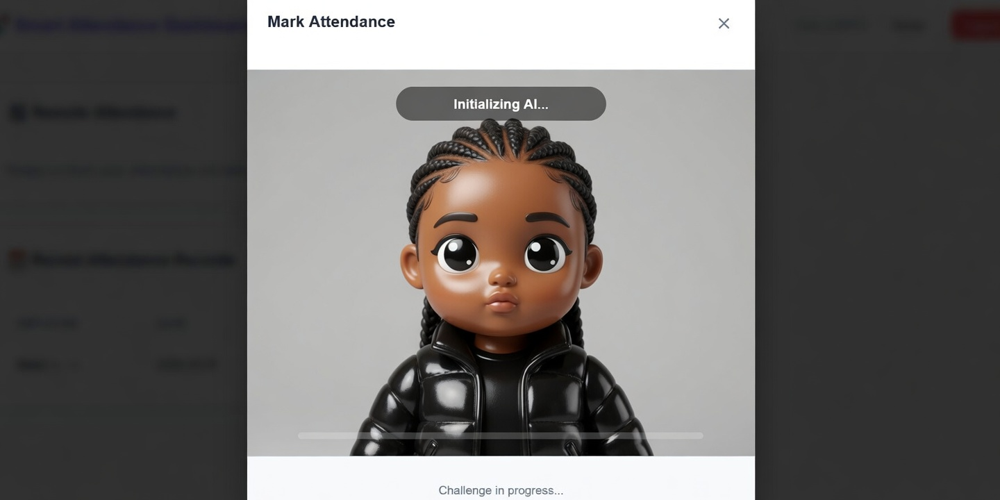
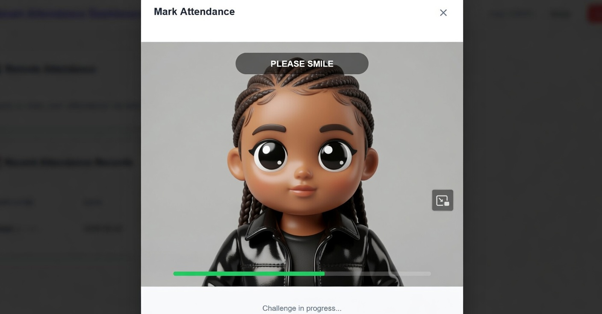
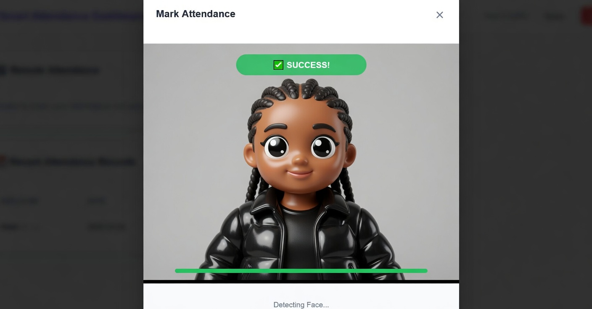

# 🔐 AI-Powered Smart Attendance System

[](https://www.python.org/)
[](https://fastapi.tiangolo.com/)
[](https://pytorch.org/)
[](LICENSE)

Enterprise-grade attendance management system with AI facial recognition, liveness detection, and advanced security.

---

## Features

- AI-powered facial recognition with 99.6% accuracy
- Anti-spoofing liveness detection
- Local and remote attendance modes
- IP geofencing and encrypted biometric storage
- Role-based access control with JWT authentication

---

## Tech Stack

FastAPI • PyTorch • FaceNet • MTCNN • OpenCV • SQLAlchemy • JWT • Fernet Encryption

---

## Installation

```bash
git clone https://github.com/hawitariku/AI-Powered-Smart-Attendance-System-with-Facial-Recognition.git
cd AI-Powered-Smart-Attendance-System-with-Facial-Recognition

python -m venv venv
source venv/bin/activate  # Windows: venv\Scripts\activate

pip install -r requirements.txt

python init_db.py
python init_users.py

python -m uvicorn app.main:app --host 127.0.0.1 --port 8002 --reload
```

Access at: **http://127.0.0.1:8002**

---

## Screenshots

### Login Page


### Admin Dashboard


### Face Enrollment




---

## Configuration

Create `.env` file with your keys:

```env
SECRET_KEY=your-secret-key
ENCRYPTION_KEY=your-encryption-key
```

---

## License

MIT License - see [LICENSE](LICENSE)

---

<div align="center">

**Made by Hawi Tariku**

⭐ Star this repo if you find it useful!

</div>
